# Know-How: Complex component transformations in Viewer - Part 1 (Basics)

In some of our previous blog posts we touched the idea of component translation and rotation. More complex transformations, like rotation of one component around another one, are usually accompanied by frustration with translation/rotation matrices, matrix inverses, quaternions and other fun stuff that rapidly gets out of hand in case of more complex hierarchical transformations. 

In this 2 parts post, I will present another approach:

In the first part of this tutorial, I will explain the basics of the proposed approach along with an illustration on a very simple model. You can see the expected result [here](http://sample-collection.s3-website-us-east-1.amazonaws.com/WoodenWatch.html).

In the second part, I will present how this approach can be applied for more complex transformations and all that will be illustrated on a more complex model. The expected result can be observed [here](http://sample-collection.s3-website-us-east-1.amazonaws.com/GiroWatch.html).


To illustrate the proposed approach, I will start with a fairly simple model of desk clock:

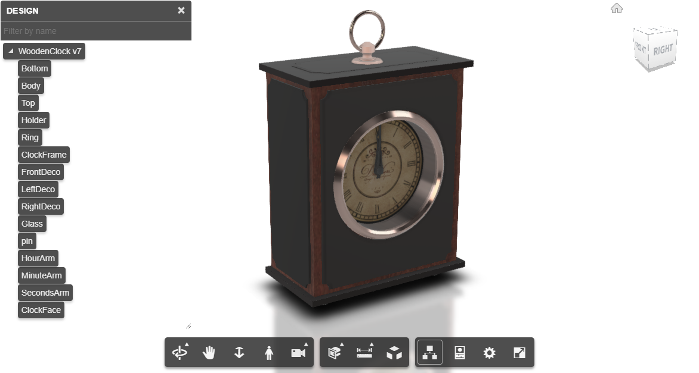

and you can see that the hours, minutes and seconds arms of the clock are grouped at 12 o'clock and fail to expose the beauty or ugliness of their design and their integration in the overall design.

Wouldn't be wonderful to have this model display the current time right in the Viewer? An excellent requirement for an online clock shop using the Viewer for illustration of available beauties.

After briefly examining the model, we can see that the task of showing the current time can be translated as "rotate *HourArm*, *MinuteArm* and *SecondsArm* components around *pin* component (based on some data, but this is not important now).

Based on experience of previous blog posts and some samples, the course of actions would be the following:


1. Get the NodeId of needed component:

    The NodeId of a needed component can be found by selecting that component and calling the ```viewer.getSelection()``` in the console, but for our purpose, based on knowledge from [Get all database id's in the model](https://forge.autodesk.com/cloud_and_mobile/2016/10/get-all-database-ids-in-the-model.html) post, this could be achieved be creating a helper function like this:

    ```javascript
    function findNodeIdbyName(name) {
        let nodeList = Object.values(tree.nodeAccess.dbIdToIndex);
        for (let i = 0, len = nodeList.length; i < len; ++i) {
            if (tree.getNodeName(nodeList[i]) === name) {
                return nodeList[i];
            }
        }
        return null;
    }
    ```

1. Get the fragments and fragment proxy corresponding to a node:

    This is usually achieved with a following code:
    ```javascript

    let tree = viewer.model.getData().instanceTree

    tree.enumNodeFragments(nodeId, function (frag) {
        let fragProxy = viewer.impl.getFragmentProxy(viewer.model, frag);

        //do some work with fragment proxy

    });
    ```

1. Get transforms for each fragment proxy, modify them and "commit" the changes:

    ```javascript
    ...
    fragProxy.getAnimTransform();
    fragProxy.position = some_new_position;
    fragProxy.quaternion = some_new_rotation;
    fragProxy.updateAnimTransform();
    ...
    ```

1. Update the scene, by calling ```viewer.impl.sceneUpdated(true);```


Thus, for our example, to rotate (around X axis) the *SecondsArm*, the code would look something like:
```javascript
let secondsArm_Id = findNodeIdbyName('SecondsArm');
let tree = viewer.model.getData().instanceTree;

tree.enumNodeFragments(secondsArm_Id, function (frag) {
    var fragProxy = viewer.impl.getFragmentProxy(viewer.model, frag);
    fragProxy.getAnimTransform();
    fragProxy.quaternion = new THREE.Quaternion().setFromAxisAngle(
                                    new THREE.Vector3(1,0,0), 
                                    -Math.PI/2);
    fragProxy.updateAnimTransform();
});

viewer.impl.sceneUpdated(true);

```

Thus, the result of strightforward (90 degrees) rotation of the *SecondsArm* will result in something like this:

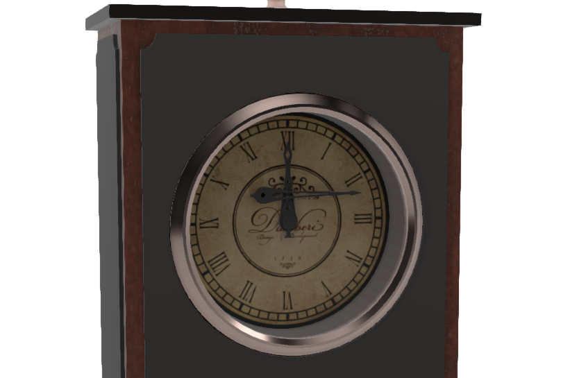


As you can see, component rotation is not a big deal, but the problem is that the rotation is around its "gravity center", while we would like to rotate it around another axis, and in our example we are lucky that it is just around X axis, at *pin* coordinates.

In this case, any self respecting book on computer graphics will tell you that it is basically calculation of its new translation and rotation, and this is where the fun with translation matrix, rotation matrix and inverses come into play and the natural course of action is to abstract all this and come up with a system.

The funny thing is that sooner or later you'll realize that you are building your [" ... own theme park, with blackjack and ..."](http://www.imdb.com/title/tt0756891/quotes), while all this already exists in three.js library upon which Autodesk Viewer is based.

It is true, that your model is not integrated into three.js scene as you might expect, but this doesn't mean that we cannot use indirectly it's "logic".

To better illustrate my point, let us start with a fairly simple three.js example, based on [Three.js getting Started project](https://threejs.org/docs/#manual/introduction/Creating-a-scene):

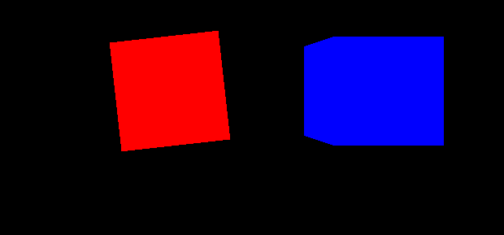

In this very example both cubes were added to the scene (to the root node), the red one right in "the center of the Universe", while the blue one somewhere in the world:

```javascript
...

scene.add(red_cube);
scene.add(blue_cube);

camera.position.z = 5;
blue_cube.position.x = 2;

var animate = function () {
    requestAnimationFrame(animate);

    red_cube.rotation.z += 0.01;

    renderer.render(scene, camera); 
};

...
```

Now, what it takes to rotate the the blue cube around the red one?
Just one line:

```javascript
...
    scene.add(red_cube);
    // scene.add(blue_cube);
    red_cube.add(blue_cube);
...

```

which give us:

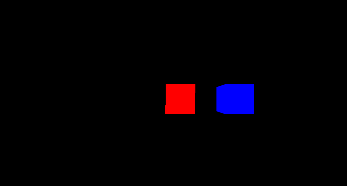


Thus, instead of adding the blue cube to the scene "directly", we add it "indirectly" by adding it to the red one, thus creating a parent-child relation, where the red cube is the parent, while the blue one is a child, and all subsequent transformations on parent will influence its dependents.


Yeah, good to know, but how this could be useful in our case?

In one of our old [posts](https://forge.autodesk.com/cloud_and_mobile/2015/01/add-geometry-with-autodesk-view-data-api-by-threejs.html), and in [a newer one](https://forge.autodesk.com/blog/adding-custom-lines-forge-viewer-scene) we illustrated how to add three.js objects to Viewer's scene. 

Now guess what happens if we add another object, not to the scene, but as a child to the first one.

Obviously the parent-child relation is working in the Viewer for the three.js objects, but how this can be useful?

Well, we cannot assign a component of our model to be a child of three.js object, but we can easily read the three.js transformation data and assign the needed ones to our model.

In other words, to rotate the SecondsArm component around the Pin component, we can do the following:

1. create an empty three.js object and add it to the Viewer scene. Let us call it *pivot_seconds* object:

    For debugging purposes we will assign it a geometry and a material, just to illustrate it's position in our viewer, but in the end we can just create a ```new THREE.Mesh()``` to make it "invisible"
    ```javascript

    let seconds_pivot = new THREE.Mesh(
                            new THREE.BoxGeometry(10, 10, 10),
                            new THREE.MeshBasicMaterial({ color: 0xff0000 }));


    viewer.impl.scene.add(seconds_pivot);

    ```

    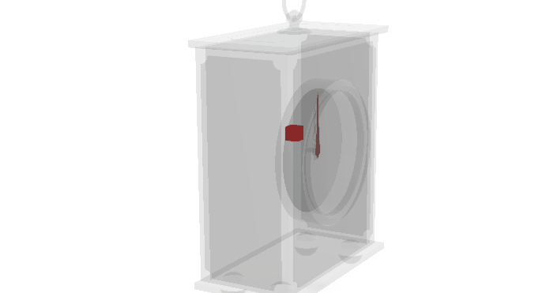

1. move the pivot_seconds object to same position as Pin component position:
    
    For that, we will need to get the current pin position, which could be abstracted as:

    ```javascript
    function getFragmentWorldMatrixByNodeId(nodeId) {
        let result = {
            fragId: [],
            matrix: [],
        }
        tree.enumNodeFragments(nodeId, function (frag) {

            let fragProxy = viewer.impl.getFragmentProxy(viewer.model, frag);
            let matrix = new THREE.Matrix4();

            fragProxy.getWorldMatrix(matrix);

            result.fragId.push(frag);
            result.matrix.push(matrix);
        });
        return result;
    }

    //some nodes might contain several fragments, but in our case we know it has one fragment

    let pin_position = getFragmentWorldMatrixByNodeId(pin_Id).matrix[0].getPosition().clone();
    seconds_pivot.position.x = pin_position.x;
    seconds_pivot.position.y = pin_position.y;
    seconds_pivot.position.z = pin_position.z;

    ```
    
    And we have it exactly where we needed:

    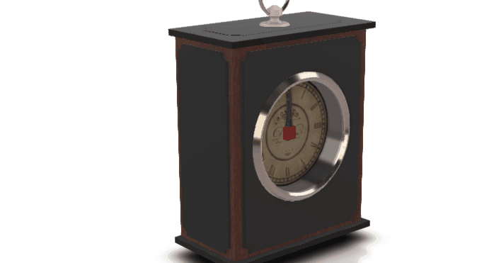 


1. add another empty three.js object and add it to the pivot_seconds object. Let us call it *seconds_helper*, as it helps us to get the needed position for the *SecondsArm*:
    ```javascript
    let seconds_helper = new THREE.Mesh(
                                new THREE.BoxGeometry(5, 5, 5),
                                new THREE.MeshBasicMaterial({ color: 0x0000ff }));
    let secondsArm_position = getFragmentWorldMatrixByNodeId(secondsArm_Id).matrix[0].getPosition().clone();
    seconds_helper.position.x = secondsArm_position.x;
    seconds_helper.position.y = secondsArm_position.y;
    seconds_helper.position.z = secondsArm_position.z;
    ```
    Here comes the most important part:
    If we add *seconds_helper* directly to the scene by calling ```viewer.impl.scene.add(seconds_helper)```:

    

    by using a simple debugging piece of code:
    ```javascript
    console.log("Pin position = " + JSON.stringify(seconds_pivot.position));
    console.log("SecondsArm position = " + JSON.stringify(secondsArm_position));
    console.log("Helper position = " + JSON.stringify(seconds_helper.position));
    ```

    we can investigate the positions:

    ```
    Pin position = {"x":15.75,"y":-11.25,"z":-0.0030820071697235107}
    SecondsArm position = {"x":19.25,"y":7.5,"z":0}
    Helper position = {"x":19.25,"y":7.5,"z":0}
    ```

    Our helper will be at *SecondsArm* component's position, but it wouldn't be much of help.

    On the other hand, if we add it as a child of the *seconds_pivot* , by calling ```seconds_pivot.add(seconds_helper);``` we end up with something different than expecting:

    
   

    If we check the debug output, we get the same positions as before, but the catch is that in case of *seconds_helper*, that position is relative to is parent. To see its world position, the following debugging snippet will help:

    ```javascript
    seconds_pivot.updateMatrixWorld();
    var seconds_helper_wold_position = new THREE.Vector3();
    seconds_helper.localToWorld(seconds_helper_wold_position);
    console.log("Helper's World position = " + JSON.stringify(seconds_helper_wold_position));
    ```

    which give us the world position:
    ```
    Helper's World position = {"x":35,"y":-3.75,"z":-0.0030820071697235107}
    ```

    As you can see, that's explains why the blue box is not at expected coordinates.
    From this point there are several ways to approach this, but the one that I'm using is through creation of :

    Let us look at the offset - the distance between the needed component and the wanted pivot, which in our case would be: 

    >|          | Pin position  | SecondArm position | Offset  |
    >|----------|:-------------:|-------------------:|--------:|
    >| X        |  15.75        |   19.25            | 3.5     |
    >| Y        |  -11.25       |   7.5              | 18.75   |
    >| Z        | ~ 0           |    ~ 0             |~ 0      |


    Knowing this offset, the position of our *seconds_helper* would be:

    ``` - [SecondArm position] + [abs(Offset)]```

    Why so complicated?

    The thing is that when you are assigning a new position to a fragment proxy, you are not assigning the World position, but a local one.

    To better illustrate this as a side note, let us assign 10 units to fragments of the "Holder" component and see how it affects the World position:

    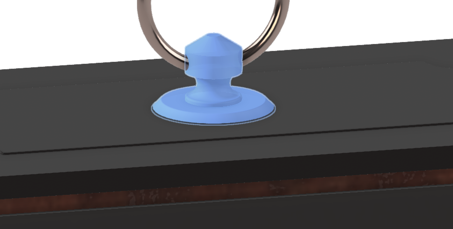

    By calling the scary construction:
    ```javascript
    let Holder_Id = findNodeIdbyName('Holder');
    console.log(JSON.stringify(getFragmentWorldMatrixByNodeId(Holder_Id).matrix[0].getPosition()));
    ```
    we get:
    ```
    {"x":0,"y":81.74999237060547,"z":0}
    ```
    Now using the already mentioned approach and assign 10 to fragment's Y position:

    ```javascript
    let secondsArm_Id = findNodeIdbyName('SecondsArm');
    let tree = viewer.model.getData().instanceTree;

    tree.enumNodeFragments(Holder_Id, function (frag) {
        var fragProxy = viewer.impl.getFragmentProxy(viewer.model, frag);
        fragProxy.getAnimTransform();
        fragProxy.position.y = 10
        fragProxy.updateAnimTransform();
    });

    viewer.impl.sceneUpdated(true);
    ```
    we moved the component up:

    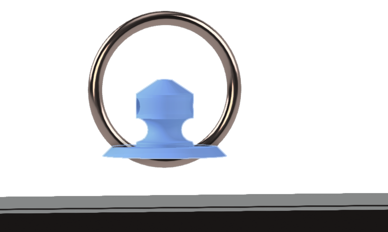

    and it's world position now changed to 
    ```
    {"x":0,"y":91.74999237060547,"z":0}
    ```

    Thus, the fragment proxy's transformations are just "portals" to modify the component's world position and not to set it (this is whay it is called a proxy after all).


    Now, back to our "offset thing". As I said, knowing this offset, the position of our *seconds_helper* would be:

    ``` - [SecondArm position] + [abs(Offset)]```

    or 
    ```javascript
    seconds_helper.position.x = - secondsArm_position.x + Math.abs(secondsArm_position.x - seconds_pivot.position.x);
    seconds_helper.position.y = - secondsArm_position.y + Math.abs(secondsArm_position.y - seconds_pivot.position.y);
    seconds_helper.position.z = - secondsArm_position.z + Math.abs(secondsArm_position.z - seconds_pivot.position.z);
    ```

    which in our debug output will give us
    ```
    PinPivot position = {"x":15.75,"y":-11.25,"z":-0.0030820071697235107}
    SecondsArm component position = {"x":19.25,"y":7.5,"z":0}
    Helper position = {"x":-15.75,"y":11.25,"z":0.0030820071697235107}
    ```

    Why this offset is need, will be explained in the second part of this blog post, where we will deal with complex transformation, but for now just believe me that these are the needed operations.


1. apply *seconds_helper* transforms *SecondsArm* component's transform:
    
    This is done by decomposing the *seconds_helper* transformation into position, scale and rotation(quaternion) and could be stated as a following function:
    
    easily achieved by steps that could be embedded in a following :

    ```javascript
    function assignTransformations(refererence_dummy, nodeId) {
        refererence_dummy.updateMatrixWorld();
        var position = new THREE.Vector3();
        var rotation = new THREE.Quaternion();
        var scale = new THREE.Vector3();
        refererence_dummy.matrixWorld.decompose(position, rotation, scale);

        tree.enumNodeFragments(nodeId, function (frag) {
            var fragProxy = viewer.impl.getFragmentProxy(viewer.model, frag);
            fragProxy.getAnimTransform();
            fragProxy.position = position;
            fragProxy.quaternion = rotation;
            fragProxy.updateAnimTransform();
        });
    }
    ```
    This is the 


    Thus, as we mentioned in the previous step, if we have
    ```
    SecondsArm component position = {"x":19.25,"y":7.5,"z":0}
    ```
    and we assign to fragment proxy the position of the helper
    ```
    Helper position = {"x":-15.75,"y":11.25,"z":0.0030820071697235107}
    ```
    the resulted position 
    ```
    SecondsArm component new position = {"x":3.5,"y":18.75,"z":0.0030820071697235107}
    ```


After looking at all this, many of you might think that those matrix things might not be so scary after all and all this method is quite complicated, thus making this blog useless if not to say more.

These thoughts will dissappear very fast when you realize that after a small setup (whose logic I tried to explain above), further component manipulations like rotation around another component, becomes super easy.

Thus in our case, the only thing we need now, to have the *SecondsArm* component rotate around the Pin component is to call: 

```javascript 
    seconds_pivot.rotation.x = some_value;
    assignTransformations(seconds_helper, secondsArm_Id);
    viewer.impl.sceneUpdated();
```
which can be abstracted further to a single function, but these are already just technicalities.

Back to our clock thing, having setup like this:
```javascript
/* ====================== SECONDS ================= */
let seconds_pivot = new THREE.Mesh();
let pin_position = getFragmentWorldMatrixByNodeId(pin_Id).matrix[0].getPosition().clone();
seconds_pivot.position.x = pin_position.x;
seconds_pivot.position.y = pin_position.y;
seconds_pivot.position.z = pin_position.z;

let seconds_helper = new THREE.Mesh();
let secondsArm_position = getFragmentWorldMatrixByNodeId(secondsArm_Id).matrix[0].getPosition().clone();
seconds_helper.position.x = - secondsArm_position.x + Math.abs(secondsArm_position.x - seconds_pivot.position.x);
seconds_helper.position.y = - secondsArm_position.y + Math.abs(secondsArm_position.y - seconds_pivot.position.y);
seconds_helper.position.z = - secondsArm_position.z + Math.abs(secondsArm_position.z - seconds_pivot.position.z);

viewer.impl.scene.add(seconds_pivot);
seconds_pivot.add(seconds_helper);
```

It is very easy to make the SecondsArm component show the almost realtime seconds:
```javascript
setInterval(function () {
    var timing = new Date();

    seconds_pivot.rotation.x = -1 * timing.getSeconds() * 2 * Math.PI / 60;
    assignTransformations(seconds_helper, secondsArm_Id);
    viewer.impl.sceneUpdated();

}, 1000);

```
That's it!
By repeating same steps for MinuteArm and HourArm, you will have a model of a desk clock showing a real time, as illustrated [here](http://sample-collection.s3-website-us-east-1.amazonaws.com/WoodenWatch.html).

Now you should have the necessary ingredients to make you models even more appealing, by embedding small animations or functionality illustrations. At least a clock shop is ready to go. 

At this step, some of you may still look skeptical at this approach and wonder what it is a big deal about it, as it is not much easier than just creating a matrix out of 3 matrices. Don't worry, you are perfectly right ... at some extent ... that till you have to deal with a more complex chained transformations and to illustrate this, I invite you to reinforce our knowledge on a more complex model in second part [Chained transforms]() post.


# Know-how: Complex component transformations in Viewer - Part 2 (Hierarchical Transformations)

In [part 1](https://forge.autodesk.com/blog/know-how-complex-component-transformations-viewer-part-1-basics) of this series, we discussed about basics of component transformations using three.js, while in this part we will see how the presented approach can be applied to a more complex hierarchical transformations.

To illustrate this, I will use a fairly old, yet useful simple model of a 4DOF robotic arm, that in my opinion is an excellent example of how model's components could hierarchically depend on another's position creating a dependecy link ([kinematic chain](https://en.wikipedia.org/wiki/Kinematic_chain)).


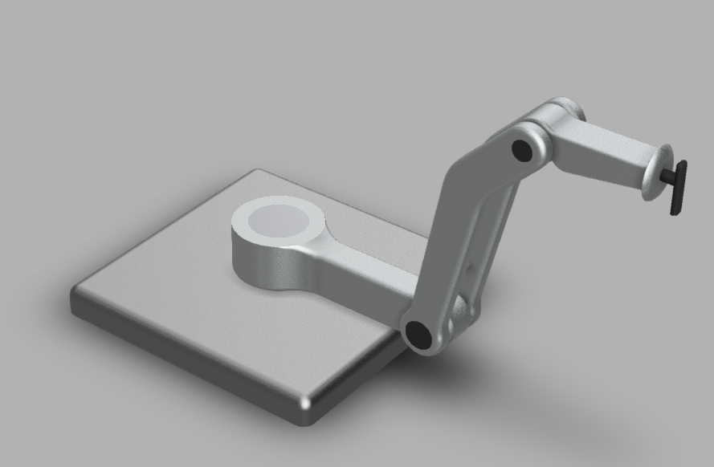


As all other examples in this serie, the code abstraction will be reduced to the minimum for sake of simplicity and since, what you see is what you have, it is also open for different "on fly" manipulations and experimentations. 

Moreover, this model contains some design errors (positional missalignments), so the reduced code abstraction will also allow me to demonstrate (along the way) how these kind of "mistakes" can be easily corrected "on the fly", a minor thing that might be critical in situations when you don't have access to the "original" model and a very important use case to keep in mind if you are condidering abstracting all this code into a simple library or a framework.

In [previous part](https://forge.autodesk.com/blog/know-how-complex-component-transformations-viewer-part-1-basics), we had a simple desk clock model and we managed to implement basic rotations of the seconds, minutes and hour arms by having 3 independent pivots.

This model, on the other hand, contains 7 components needed to be transformed and the transformation of some components is influenced and might influence others, forming a sort of dependency tree:

    A
    |-B
      |-C
      |-D
        |-E
        |-F
          |-G

In other words, if (for example) component D is transformed (in our case rotated around C), then it should affect the position/orientation of its depencies E and F. Obiously, any transformation propagated to F is also propagated to its dependents (in this case just G).

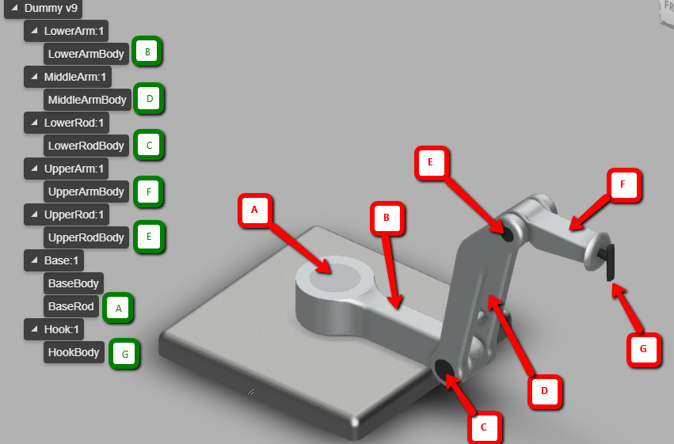

In this model we 4 axis, so we have to rely on 4 pivots that will be positioned at A, C, E and G. 
After [previous post]() the start should be simple, create a pivot at position of A component and a helper (taking into consideration the offset) which will be responsible for adjusting the "linked" B component:

```javascript
let Pivot_BaseRod = new THREE.Mesh(new THREE.BoxGeometry(5, 5, 5), 
                             	  new THREE.MeshBasicMaterial({ color: 0xff0000 }));
let Position_BaseRod = getFragmentWorldMatrixByNodeId(ID_BaseRod).matrix[0].getPosition().clone();
Pivot_BaseRod.position.x = Position_BaseRod.x;
Pivot_BaseRod.position.y = Position_BaseRod.y;
Pivot_BaseRod.position.z = Position_BaseRod.z;
viewer.impl.scene.add(Pivot_BaseRod);


let Helper_LowerArmBody = new THREE.Mesh();
let Position_LowerArmBody = getFragmentWorldMatrixByNodeId(ID_LowerArmBody).matrix[0].getPosition().clone();
Helper_LowerArmBody.position.x = - Position_LowerArmBody.x + Math.abs(Position_LowerArmBody.x - Pivot_BaseRod.position.x);
Helper_LowerArmBody.position.y = - Position_LowerArmBody.y + Math.abs(Position_LowerArmBody.y - Pivot_BaseRod.position.y);
Helper_LowerArmBody.position.z = - Position_LowerArmBody.z + Math.abs(Position_LowerArmBody.z - Pivot_BaseRod.position.z);
Pivot_BaseRod.add(Helper_LowerArmBody);
```

Giving the expected (for those who looked at the previous article) positions:

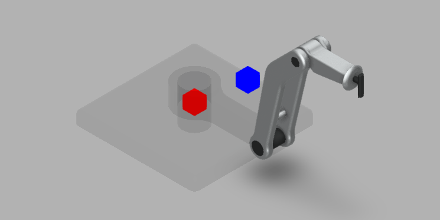


However, what about the subsequent components?

The overall algorithm here is fairly simple, for each axis, create a pivot and for each component, create a helper linked to the needed axis.

However, there is one thing we have to keep in mind and it has to do with offset we briefly mentioned in the [previous part]().

The offset for the first handler is simple, as it takes into consideration just the pivot position, but in case of a handler depending on a pivot that depends on another pivot (as in this case D depends on C, which dependes on A), the sitaution complicates, but not very much:
```javascript
let Pivot_LowerRodBody = new THREE.Mesh();
let Position_LowerRodBody = getFragmentWorldMatrixByNodeId(ID_LowerRodBody).matrix[0].getPosition().clone();

Pivot_LowerRodBody.position.x = Position_LowerRodBody.x - Pivot_BaseRod.position.x;
Pivot_LowerRodBody.position.y = Position_LowerRodBody.y - Pivot_BaseRod.position.y;
Pivot_LowerRodBody.position.z = Position_LowerRodBody.z - Pivot_BaseRod.position.z;
Pivot_BaseRod.add(Pivot_LowerRodBody);

let Helper_LowerRodBody = new THREE.Mesh();
Helper_LowerRodBody.position.x = - Position_LowerRodBody.x + Math.abs(Position_LowerRodBody.x - Pivot_LowerRodBody.position.x - Pivot_BaseRod.position.x);
Helper_LowerRodBody.position.y = - Position_LowerRodBody.y + Math.abs(Position_LowerRodBody.y - Pivot_LowerRodBody.position.y - Pivot_BaseRod.position.y);
Helper_LowerRodBody.position.z = - Position_LowerRodBody.z + Math.abs(Position_LowerRodBody.z - Pivot_LowerRodBody.position.z - Pivot_BaseRod.position.z);
Pivot_LowerRodBody.add(Helper_LowerRodBody);
```

As you can see, here we have two relatively new things:

- When creating a pivot that depends on another pivot (pivot child of the another pivot), we have to place it at rotation point, but keep into consideration that it's position is related to parent and not the World, so we have to substract the parent's position.
For example for pivot corresponding to component E, we have to take into consideration the position of component E, pivot coresponding to C and the one corresponding to A:

```javascript
...

let Pivot_UpperRodBody = new THREE.Mesh();
  let Position_UpperRodBody = getFragmentWorldMatrixByNodeId(ID_UpperRodBody).matrix[0].getPosition().clone();

  Pivot_UpperRodBody.position.x = Position_UpperRodBody.x - Pivot_LowerRodBody.position.x - Pivot_BaseRod.position.x;
  Pivot_UpperRodBody.position.y = Position_UpperRodBody.y - Pivot_LowerRodBody.position.y - Pivot_BaseRod.position.y;
  Pivot_UpperRodBody.position.z = Position_UpperRodBody.z - Pivot_LowerRodBody.position.z - Pivot_BaseRod.position.z;
  Pivot_LowerRodBody.add(Pivot_UpperRodBody);
...
```

- Another thing is related to helpers. If for direct helpers (those depending on root pivot), we took into consideration just the offset from pivot position, then now we have to "accumulate" these offsets:

```javascript
...

let Helper_UpperRodBody = new THREE.Mesh();

Helper_UpperRodBody.position.x = - Position_UpperRodBody.x + Math.abs(Position_UpperRodBody.x - Pivot_UpperRodBody.position.x - Pivot_LowerRodBody.position.x - Pivot_BaseRod.position.x);
Helper_UpperRodBody.position.y = - Position_UpperRodBody.y + Math.abs(Position_UpperRodBody.y - Pivot_UpperRodBody.position.y - Pivot_LowerRodBody.position.y - Pivot_BaseRod.position.y);
Helper_UpperRodBody.position.z = - Position_UpperRodBody.z + Math.abs(Position_UpperRodBody.z - Pivot_UpperRodBody.position.z - Pivot_LowerRodBody.position.z - Pivot_BaseRod.position.z);
Pivot_UpperRodBody.add(Helper_UpperRodBody);

...
```


By adding some controls (in my case using the simple [dat.gui.js]() library) we end up with a "controllable" model that could serve as a perfect illustration for a simple interactive robot, ready to impress.

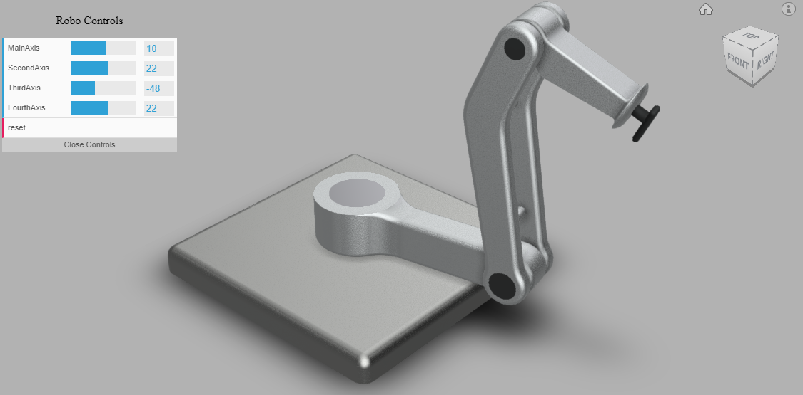

If you want to play with the final result and see how smoothly it behaves, you can find it [here](http://sample-collection.s3-website-us-east-1.amazonaws.com/DummyRobot.html).

This ends this second part, but not our quest for mastering the transformations in Viewer using three.js.
In the [next and final part]() we are going to reinforce this approach by exploring a even more complex use-case, where some of the "inherited" (coming from indirect pivots) transformations has to be selectively ignored. Why you would need that? Check this [example](http://sample-collection.s3-website-us-east-1.amazonaws.com/GiroWatch.html) upon which all will be explained.


# Know-how: Complex component transformations in Viewer - Part 3 (Selective Transformations)


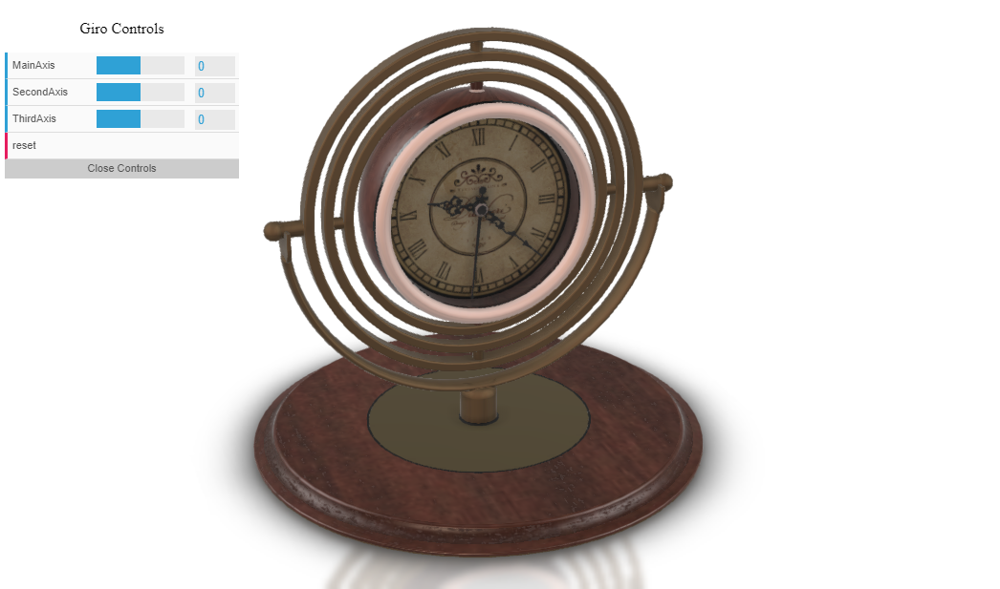

In [previous article]() I introduced an indirect way of transforming components, that allows you to avoid dealing with affine transformations directly and rely on computation results "generated" by the three.js parent-child relation.

To reinforce this approach and illustrate its benefits in a more complex use case, in what follows, I invite you to join me in my endeavor of bringing some interaction to a bit more complex model, that I called GiroWatch.

Thus, our requirements are the following:

1. implement hour, minute, second rotations, to reflect current time.

1. implement a manipulator (slider) that a user can interact with, to change the frame rotations.

The first point is quite simple, as we already achieved similar thing in [previous article](), but we will return to this requirement toward the end, as the Pin component is now not independent as in previous example, but a child of ClockBody.

Thus, let us start by mapping the "imaginative" hierarchical tree:

    [Center]
    - [MainFrame]
        - [SecondFrame]
            - [ThirdFrame]
            - [ClockBody]
                - [Glass]
                - [HourDial]
                - [Pin]
                    - [SecondsArm]
                    - [MinuteArm]
                    - [HourArm]

I came up with a "giroscopic" thing on purpose, as it's magic nature cannot be always resolved by a streightforward hierarchy - some parent rotations must be propagated, while some of them should be ignored. This becomes quite confusing when using the matrix transformations, while in our case it will be dealt fairly easy, through creation of a proxy object that will compensate the unwanted transformations.


